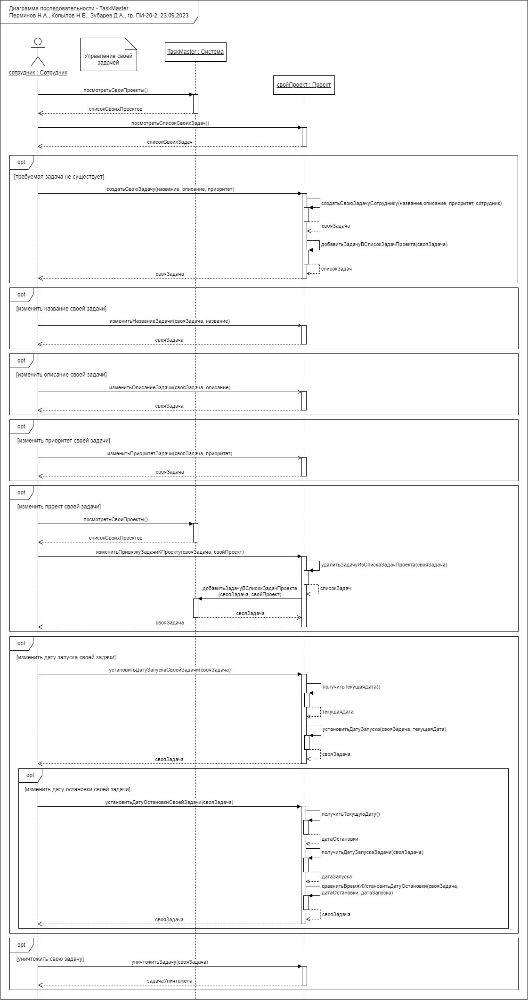
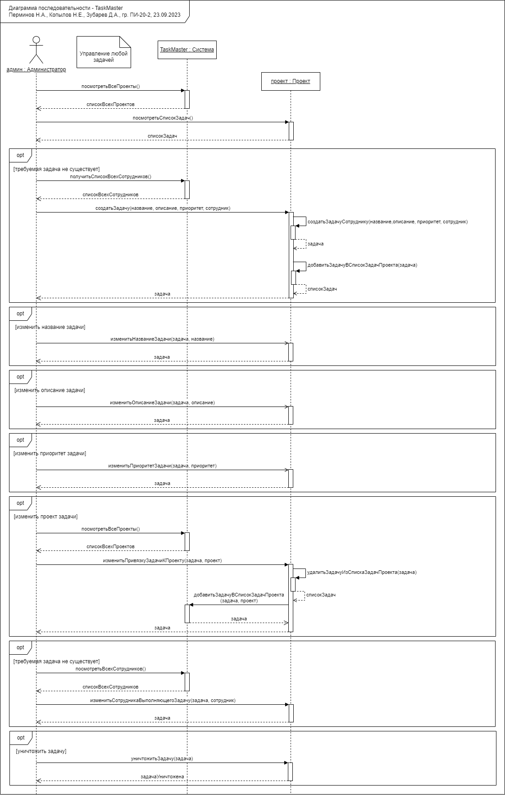
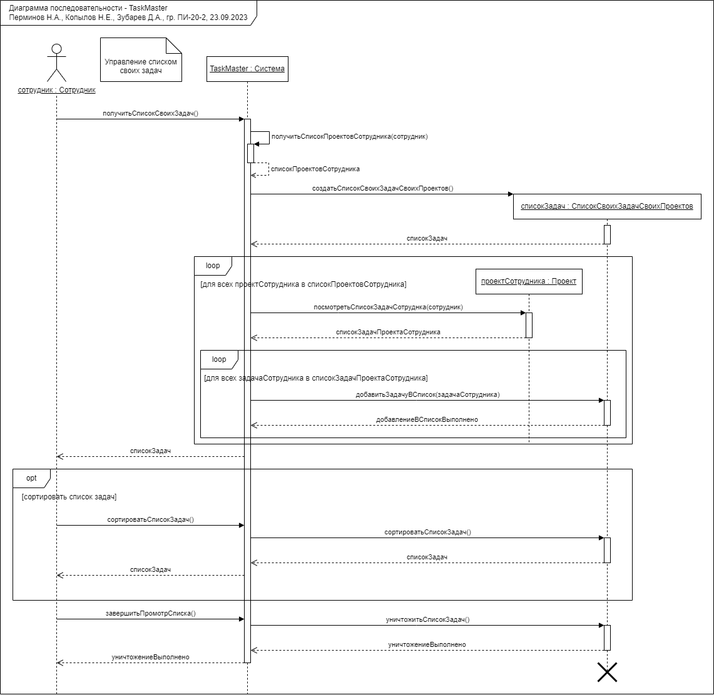
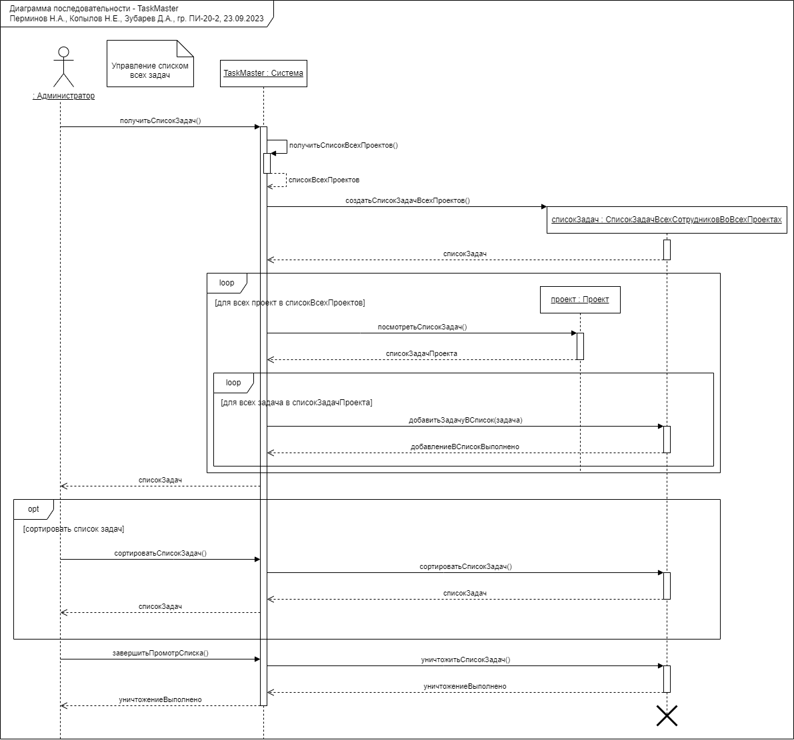

---
csl: gost-r-7-0-5-2008-numeric-iaa.csl
bibliography: demo.bib
...

# Построение диаграмм последовательности 

На отдельной диаграмме последовательности происходит визуализация особенностей реализации каждого варианта использования. 

Достаточно построить диаграммы последовательности для основных (главных) прецедентов:

1. Управление своей задачей
1. Управление задачей любого сотрудника
1. Управление списком своих задач
1. Управление списком всех задач

## Управление своей задачей

Ниже на рисунке -@fig:myfigure1 представлена диаграмма последовательности построенной на основе прецедента "Управление своей задачей".

{#fig:myfigure1 height=24.5cm}

## Управление задачей любого сотрудника

Ниже на рисунке -@fig:myfigure2 представлена диаграмма последовательности построенной на основе прецедента "Управление задачей любого сотрудника".

{#fig:myfigure2 height=20.5cm}

## Управление списком своих задач

Ниже на рисунке -@fig:myfigure3 представлена диаграмма последовательности построенной на основе прецедента "Управление списком своих задач".

{#fig:myfigure3 height=20.5cm}

## Управление списком всех задач

Ниже на рисунке -@fig:myfigure4 представлена диаграмма последовательности построенной на основе прецедента "Управление списком всех задач".

{#fig:myfigure4 height=20.5cm}
