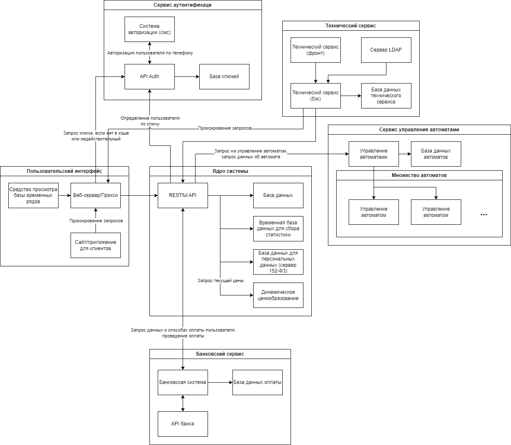

---
csl: gost-r-7-0-5-2008-numeric-iaa.csl
bibliography: demo.bib
...

<!-- Итеративный подход к процессу разработки (характерный для MSF) требует использования гибкого способа ведения документации. Живые документы (living documents) должны изменяться по мере эволюции проекта. Такой подход существенно отличается от принципов ведения документации в известной каскадной модели, где процесс разработки начинается лишь после того, как готовы и зафиксированы все требования и спецификации.
Документация проектов MSF, также как и программный код, разрабатывается итеративно. На фазе выработки концепции планы имеют форму описания высокоуровневых подходов (approaches) и по мере подготовки распространяются среди членов проектной группы и других заинтересованных лиц для получения отзывов. К примеру, подход к тестированию может быть кратко сформулирован во время фазы выработки концепции, а его превращение в план тестирования происходит на более поздних фазах. После перехода к фазе планирования документы постепенно дорабатываются, возникающие детальные планы снова поступают на проверку всем заинтересованным сторонам, и описанный процесс повторяется итеративно. Типы планов и общее количество описывающих их документов могут варьироваться от проекта к проекту. -->

# Необходимость проекта

## Обоснование необходимости

<!-- Сформулируйте, на разрешение каких проблем и/или удовлетворение каких потребностей заинтересованных сторон направлен проект. -->

Необходимость проекта обусловлена потребностью создания собственной программно-аппаратной системы для реализации коммерческого проекта по краткосрочной аренде через вендинговые аппараты. 

Не существует аналогичного программного обеспечения, обладающего подобным функционалом, так как стартап реализует инновационную бизнес-модель. 

Для тех, кто хочет провести время на свежем воздухе, предлагается решение проблемы – посуточная аренда пледов через приложение и вендинговые автоматы, не приобретая пледы, которые будут использоваться однократно. С помощью данного проекта проблема холода во время прогулки может быть решена на время, так как пледы обогревают на протяжении аренды, позволяя продолжить прогулку. Основываясь на тенденциях поведения потребителей, нужно обратить внимание на актуальность продукта. Современные люди ценят удобство и мгновенный доступ к услугам. Развитие вендинговых аппаратов для посуточной аренды пледов соответствует этим потребностям, предоставляя быстрое и легкодоступное решение для тех, кто желает комфортно провести время на улице. Проект также значим в в контексте экологии: предложение аренды пледов на время позволяет избежать покупки одноразовых предметов, что в свою очередь снижает отходы и потребление ресурсов. Не менее важно влияние проекта на социальную активность. Поощряя людей проводить больше времени на улице, продукт способствует развитию здоровья и общего состояния. Проект также ориентирован на местный туризм: парки Москвы являются неотъемлемой частью туристической зоны города, поэтому проект имеет потенциал поддержки местной экономики и привлечения туристов.

## Видение проекта

<!-- Видение (vision) – это ничем не ограничиваемое представление о том, каким должно быть решение (solution). Видение проекта направлено на формирование у всех вовлеченных в проект сторон единого понимания его концепции. Формулировка видения (vision statement) должна быть достаточно краткой для запоминания, достаточно ясной для понимания и достаточно сильной для мотивирования. Хорошая формулировка видения ориентируется на пять SMART характеристик:
Specific (определенность/конкретность) – видение четко указывает на то (идеальное) состояние, достижение которого является целью проекта.
Measurable (измеримость) – дает проектной группе четкий критерий успешности проекта и достижения поставленных целей.
Achievable (достижимость) – цели, сформулированные в видении, должны быть достижимы в рамках имеющихся ресурсов, времени и возможностей команды. Достижимость мотивирует команду на выполнение проекта.
Relevant (обоснованность) – цели, сформулированные в видении, должны иметь существенное значение для заинтересованных сторон и напрямую быть связанными с их проблемами и/или потребностями.
Time-based (ограниченность во времени) – видение должно четко указывать на ожидаемые временные рамки, в которые решение будет достигнуто.
Сформулируйте (максимально кратко, в одной двух фразах) видение проекта. -->

Проект направлен на разработку в период с 1 сентября 2023 года по 24 марта 2024 года программно-аппаратной системы, которая позволит реализовать автоматизированную краткосрочную аренду пледов через вендинговые аппараты, а именно выдачу и прием пледов, сбор использованных пледов.

## Анализ выгод

<!-- Основываясь на сформулированном выше видении проекта, перечислите, какие выгоды получат заинтересованные стороны по завершении проекта (в результате внедрения и использования решения).  Здесь указать стейкхолдеров и для каждого расписать выгоды, чтобы было более понятно без обращения к другим документам. Отсюда пойдут требования к продукту, поэтому это важно--> 

### Финансовые выгоды

Разработка программно-аппаратного продукта позволит реализовать коммерческий проект, по финансовой модели которого средний доход с 1 автомата составит 120 тысяч рублей в месяц, при рентабельности до 50% в сезон или 25% за год.

Бизнес-модель заключается в создании нескольких тарифов, при этом себестоимость одной покупки составляет 56 рублей. Средний чек - двести рублей. При этом точкой безубыточности будет продажа 12 пледов в день на один автомат, а рассчитываемое среднее количество покупок 22. 

Оценка рынка: TAM составляет 20 млрд рублей в год, SAM - 2 млрд рублей, SOM - 1 млрд рублей.

### Нематериальные выгоды 

В ходе реализации проекта команда разработки получает опыт работы с коммерческим проектом. 

Backend-разработчики получают опыт участия в разработке перспективного продукта, развивают и закрепляют навыки работы с незнакомыми технологиями, заносят крупный проект в портфолио.

Full-stack разработчики получают опыт участия в разработке перспективного продукта, развитие и закрепление навыков работы с незнакомыми технологиями, разработки клиентской и серверной частей коммерческого продукта, создания полноценного продукта с нуля, заносят крупный проект в портфолио.

# Концепция решения

<!-- Концепция решения (solution concept) предоставляет общее описание подходов, которые проектная группа предполагает использовать для разрешения проблем и/или удовлетворения потребностей заинтересованных сторон. -->

## Цели и Задачи

<!-- Формирование концепции решения начинается с выяснения у заинтересованных сторон, описания и фиксации проектной группой целей проекта. Далее каждая цель разбивается на измеримые компоненты – задачи.
Во взаимодействии с заинтересованными сторонами проекта сформулируйте и утвердите цели решения, на достижение которых направлен проект. Определите задачи, из которых будет складываться достижение каждой цели. -->

Главная цель проекта: сделать возможной автоматизированную краткосрочную аренду пледов (шеринга) через вендинговые аппараты, установленные на улицах и в парках города. Для этого необходимо: 

- иметь возможность автономно сдать в аренду и вернуть плед,

- иметь возможность проводить обслуживание автоматов,

- иметь возможность собирать диагностические и иные данные с автоматов.

Для достижения поставленных целей требуется выполнить следующие задачи: 

- Реализовать программную систему для клиентов сервиса, которая обеспечивает автономную и автоматическую аренду пледов через вендинговые автоматы:

  - реализовать возможность взымания платы с клиентов,

  - реализовать возможность взятия пледа из автомата,

  - реализовать возможность возврата пледа в автомат,

  - реализовать возможность нахождения ближайшего к клиенту автомата.

- Реализовать программную систему для технического обслуживания автоматов: 

  - реализовать возможность открытия ячейки автомата,

  - реализовать возможность изъятия грязных пледов из автомата, 

  - реализовать возможность выкладывания чистых пледов в автомат.

- Реализовать программную систему для мониторинга собираемых данных: 

  - реализовать возможность просмотра графиков количества взятий пледов в аренду из автомата,

  - реализовать возможность просмотра графиков количества возвратов пледов из аренды в автомат.

## Предположения и Ограничения

<!-- В процессе формирования концепции решения проектная группа постоянно взаимодействует с заинтересованными сторонами, собирая необходимую информацию о требованиях к функциональности будущего решения. Тем не менее, неизбежная неполнота информации приводит к тому, что относительно некоторых функциональных возможностей решения могут потребоваться предположения (assumptions). Помимо функциональных требований заинтересованные стороны могут выдвигать качественные требования, задающие ограничения на создаваемое решение. Также ограничения могут порождаться средой, в которой должно будет функционировать решение после внедрения.
Определите, имеются ли в проекте требования, нуждающиеся в предположениях, если да, сформулируйте их. Определите, имеются ли ограничения на будущее решение. Если да, сформулируйте их. -->

Старт происходит в городе Москва из-за высокой концентрации капитала. 

Технологии, используемые в разработке, должны быть свободно распространяемые и не должны быть подвержены влиянию санкций. Временные ограничения обусловлены техническим заданием, они не должны быть позже 31 марта 2024 года и должны соответствовать календарному плану проекта. 

Разработка технического задания должна осуществляться в соответствии с законодательством РФ: № 152-ФЗ “О персональных данных”, № 395-1 ”О банках и банковской деятельности”, № 115-ФЗ “О противодействии легализации (отмыванию) доходов, полученных преступным путем, и финансированию терроризма”. 

Санкционные ограничения не позволяют выложить мобильное приложение в сервисы _play market_ и _app store_, поэтому было принято решение разработать веб-решение с интерфейсом мобильного приложения. 

На этапе разработки системы отсутствует доступ к вендинговому аппарату. Применение аппарата должно производиться на этапе тестовой эксплуатации. 

Необходимо наладить взаимодействие разработанного программного обеспечения и аппаратов. 

## Анализ использования

<!-- Основой формулировки требований является анализ использования, включающий определение пользователей (users) и описание того, как пользователи будут взаимодействовать с решением. -->

### Пользователи

<!-- В разработке решения заинтересованы множество сторон, однако непосредственная работа с ним будет выполняться пользователями, поэтому прежде чем приступать к дизайну решения, необходимо определить, кто будет с ним взаимодействовать. В процессе анализа должны быть выделены группы пользователей (например, на основе областей их деятельности, в которых будет использоваться разрабатываемое решение).
Сформируйте список групп пользователей, для которых предназначено решение. -->

Определим пользователей системы, которые будут задавать сценарии использования.

Клиенты коммерческого проекта -- люди, гуляющие вечерами, когда на улице начинает холодать, а форма одежды была выбрана на более теплое время суток.

Специалисты технического обслуживания автоматов -- специалисты, задачами которых является поддержка рабочего состояния автоматов и выкладка/сбор пледов.

Системные администраторы -- специалисты, занимающиеся поддержкой работы программно-аппаратного комплекса.

Аналитики -- специалисты, занимающиеся анализом статистики взятий и возвратов пледов за определенный период.

### Сценарии использования

<!-- Сценарии использования (usage scenarios) определяют последовательности действий, которые пользователи выполняют при взаимодействии с решением. MSF не специфицирует явным образом способы описания сценариев использования. Один из возможных (и достаточно распространенных) вариантов – язык UML.
Для каждой выделенной на предыдущем шаге группы пользователей определите характерные способы их взаимодействия с решением и, используя необходимые диаграммы UML, опишите сценарии использования. -->

После определения сценариев использования будет возможно построение диаграмм прецедентов.

#### Для клиентов 

Были выделены следующие сценарии использования для неаутентифицированного клиента коммерческого проекта:  

- Отобразить информацию о местоположении автоматов на карте.

- Отобразить информацию об остатке пледов в автомате на карте.

Были выделены следующие сценарии использования для аутентифицированного клиента коммерческого проекта:  

- Отобразить информацию о пледах, находящихся в аренде у клиента в данный момент: тариф, время использования, общая цена аренды. 

- Взять плед в аренду: выбрать автомат, выбрать ячейку, открыть ячейку, забрать плед, закрыть ячейку.

- Добавить банковскую карту в список карт для оплаты: выбрать операцию добавления новой карты, ввести данные карты (номер, cvv, дата истечения срока действия), подтвердить добавление карты пробным списанием.

- Определить банковскую карту как стандартную для оплаты: выбрать операцию определения карты по умолчанию, выбрать необходимую карту.

- Вернуть плед: выбрать автомат, выбрать ячейку, открыть ячейку, положить плед, закрыть ячейку.

По итогу выделения сценариев использования была построена UML диаграмма прецедентов представленная на рисунке -@fig:umlUseCaseClients.

{#fig:umlUseCaseClients height=24.5cm}

#### Для специалистов технического обслуживания автоматов

Были выделены следующие сценарии использования для специалиста технического обслуживания автоматов:

- Изъять использованные пледы из автомата: выбрать автомат, открыть ячейки, отметить наличие/отсутствие пледа в ячейке, забрать пледы, закрыть ячейки.

- Вложить чистые пледы в автомат: выбрать автомат, открыть ячейки, положить чистые пледы, закрыть ячейки.

- Открыть конкретную ячейку автомата: выбрать автомат, в рамках автомата выбрать ячейку по номеру, запустить операцию открытия ячейки.

- Закрыть конкретную ячейку автомата: выбрать автомат, в рамках автомата выбрать ячейку по номеру, запустить операцию закрытия ячейки.

По итогу выделения сценариев использования была построена UML диаграмма прецедентов представленная на рисунке -@fig:umlUseCaseTechnical.

{#fig:umlUseCaseTechnical height=24.5cm}

#### Для аналитиков и системных администраторов

Были выделены следующие сценарии использования для аналитика и системного администратора:

- Отобразить статистику взятий в аренду из автоматов за определенный 
  
  период.

- Отобразить статистику возвратов пледов в автоматы за определенный 
  
  период.

- Экспорт статистики в файл формата CSV.

По итогу выделения сценариев использования была построена UML диаграмма прецедентов представленная на рисунке -@fig:umlUseCaseAnalytics.

{#fig:umlUseCaseAnalytics height=8cm}

## Требования {#sec:requirements}

<!-- Требования (requirements) определяют, что должно делать разрабатываемое решение. Требования могут выражаться в терминах функциональности или в виде правил и параметров, определяющих функциональность. -->

### Требования пользователей

<!-- Сформулируйте требования к решению с точки зрения пользователей. -->

#### Для клиентов

На основе выделенных сценариев использования были выявлены требования пользователей-клиентов коммерческого проекта:

- Система должна отображать номер ячейки автомата при взаимодействии клиента с ней.

- Система должна отображать карту с указанием местоположения автоматов и пользователя.

- Система должна отображать информацию о количестве доступных пледов в автоматах на карте.

- Система должна отображать информацию о пледах, находящихся в аренде пользователем на данный момент, а именно тариф, время пользования, общая цена аренды.

- Система должна отображать данные пользователя (номер телефона) на основной странице.

- Система должна позволять добавлять банковскую карту для оплаты с основной страницы.

- Система должна позволять указывать основную банковскую карту для оплаты.

- Пользователь должен иметь возможность выбрать автомат посредством ввода уникального кода автомата.

- Система должна предоставлять возможность выбора автомата посредством перехода по уникальной ссылке.

- Пользователь должен иметь возможность взять в аренду до 5 пледов. 

- Система должна предоставлять возможность закрытия ячейки по указанию пользователя.

- Пользователь должен иметь возможность убедиться в том, что он выбрал правильный автомат посредством отображения системой фотографии автомата.

- Система должна отображать список возможных тарифов для аренды пледа.

- Система должна позволять выбрать один из возможных тарифов для аренды пледа.

- Система должна позволять выбрать основную банковскую карту до оплаты тарифа.

#### Для специалистов технического обслуживания автоматов 

На основе выделенных сценариев использования были выявлены требования пользователей-специалистов технического обслуживания автоматов:

- Система должна отображать номер ячейки автомата при взаимодействии специалиста с ней.

- Система должна позволять выбирать автомат один раз для выполнения нескольких операций.

- Система должна организовать изъятие использованных пледов из автомата.

- Система должна позволять отмечать отсутствие пледа в ячейке (данное действие требует подтверждения).

- Система должна организовать выкладывание чистых пледов в автомат. 

- Система должна позволять открывать определенную ячейку автомата.

- Система должна позволять закрывать определенную ячейку автомата.

#### Для аналитиков и системных администраторов 

На основе выделенных сценариев использования были выявлены требования пользователей-аналитиков и пользователей-системных администраторов:

- Система должна отображать графики по количеству взятий пледов в аренду из определенного автомата за определенный период.

- Система должна отображать графики по количеству возвратов пледов в определенный автомат за определенный период.

- Система должна иметь возможность экспортировать данные в формате CSV.

### Системные требования

<!-- Сформулируйте требования к решению с точки зрения среды, в которой оно должно будет функционировать после внедрения. -->

На основе выделенных сценариев использования и анализа концепции решения были выявлены следующие системные требования:

- Система должна позволять блокировать доступ к определенной ячейке автомата.

- Система должна проводить авторизацию специалистов технического обслуживания, аналитиков, системных администраторов.

- Система должна идентифицировать пользователя с помощью номера телефона.

- Система должна подтвердить, что номер телефона пользователя принадлежит ему.

- Открытие ячейки должно происходить не позднее, чем через 1 секунду после оплаты.

- Система должна позволять пользователю открывать только одну ячейку за один запрос.

- Система должна позволять устанавливать таймеры для операций взятия и сдачи пледа, которые не будут считаться в время аренды.

- Система должна быть реализована в соответствии с федеральными законами РФ: № 152-ФЗ “О персональных данных”, № 395-1 ”О банках и банковской деятельности”, № 115-ФЗ “О противодействии легализации (отмыванию) доходов, полученных преступным путем, и финансированию терроризма”.

- Авторизация персонала должна производиться посредством протокола _LDAP_.

# Рамки

<!-- Рамки (scope) определяют пространство параметров, в котором будет создаваться решение, детализируя функциональность, определяя, что останется за рамками решения и указывая критерии, по которым заинтересованные лица будут судить о готовности решения. Рамки создаются на основе единого видения, являются результатом компромисса между сформулированными целями и условиями реальности и отражают приоритезацию заказчиком имеющихся требований к создаваемому решению. Частью процесса определения рамок проекта является вынесение менее важной функциональности из текущего проекта в планы на будущее.
Рамки решения (solution scope) определяют функциональность решения и его возможности (включая те, что не относятся к программному обеспечению). Возможность (функциональность, составляющая, feature) – это требуемый или желаемый аспект программного или аппаратного обеспечения. Например, предварительный просмотр перед печатью может быть возможностью текстового процессора; шифрование почтовых сообщений – возможностью почтовой программы. Сопроводительные руководства пользователей, интерактивные файлы помощи, операционные руководства и обучение также могут быть составляющими решения.
Рамки проекта (project scope) определяют объем работ, который должен быть выполнен проектной группой для поставки заказчику каждого из элементов, определенного рамками решения.
Управление рамками проекта критично для его успеха. MSF предлагает определять и фиксировать рамки решения и проекта, используя треугольник компромиссов и матрицу компромиссов проекта. -->

Рассмотрим границы решения:

- Функциональные границы: автоматизация процесса аренды пледов.

- Географические границы: вендинговые аппараты, выдающие и принимающие пледы. Аппараты находятся в парках города Москва. Автоматы берутся в аренду с ПО от производителя, далее это ПО может быть модифицировано или заменено. Разрабатываемое ПО подключается к арендуемому автомату. Тестирование будет производиться в зависимости от того, удастся ли получить экземпляр вендингового аппарата. Если не удастся, то тестирование будет производиться посредством моделирования реального поведения вендингового автомата. В случае, если вендинговый аппарат получить удастся, то тестирование будет производиться непосредственно на нем.  Второй вариант наиболее благоприятен, так как показывает результат test case в реальных условиях. 

- Организационные границы: техник обслуживания(забирает/раскладывает пледы по аппаратам, техническое обслуживание), посетители парков. 

## Функциональность решения

<!-- Укажите здесь функциональность в терминах возможностей (features) и функций (functions), которая будет реализована в разрабатываемом решении. -->

Рассмотрим функциональность решения: 

- Функция краткосрочной аренды пледа из автомата.

- Возможность не возврата пледа в автомат.

- Возможность вернуть плед в любой автомат (независимо от того, из какого автомата был взят плед).

- Возможность просмотра автоматов на карте с указанием количества пледов в них.

- Функция изъятия использованных пледов из автомата.

- Функция выкладывания чистых пледов в автомат.

- Функция сбора информации о количестве взятий пледов в аренду из определенного автомата за определенный период.

- Функция сбора информации о количестве возвратов пледов в автоматы за определенный период.

- Функция просмотра графиков о количестве взятий пледов в аренду из определенного автомата за определенный период. 

- Функция просмотра графиков о количестве возвратов пледов в автоматы за определенный период.

- Возможность создания графиков со статистическими данными.

- Возможность экспорта статистических данных в формате CSV.

## За рамками решения

<!-- Укажите здесь функциональность, которая имеется или предполагается в требованиях заинтересованных сторон, но не будет реализована в решении, и опишите причины вынесения данных возможностей и функций за рамки решения (используйте треугольник компромиссов). -->

За рамками разрабатываемого решения остаётся: 

- организация обработки пледов;

- организация сбора использованных и выкладывания чистых пледов;

- создание бухгалтерских отчетов и обработка данных;

- организация маркетинговых акций;

- общая организация бизнес-процессов компании ООО "ГЭТ Э БЛАНКЕТ";

- управление персоналом.

## Критерии одобрения решения

<!-- Сформулируйте здесь критерии, в соответствии с которыми заинтересованные стороны будут принимать готовность решения. -->

ООО "ГЭТ Э БЛАНКЕТ": 

- Техническая работоспособность: Программный продукт выполняет все функции описанные в разделе -@sec:requirements и подключен к вендинговому аппарату.

- User experience: Фокус-группа показывает не менее 70% удовлетворенности интерфейсом продукта (среднее значение по сумме вопросов анкетирования фокус-группы).

- Проведено приемочное (эксплуатационное) тестирование, результаты которого сопоставляются с бизнес-логикой проекта: покрытие тестов составляет 100% функциональных и нефункциональных требований, успешно завершается 100% всех тестов (примерное описание).

- Отчетность: В срок до 25 марта 2024 года представлены: концепция проекта, функциональная спецификация, спецификации и сценарии тестов, тестирование и отчеты об ошибках, отчет о пилотном внедрении, отчет о завершении проекта.

Фонд содействия инновациям:

- Финансовая эффективность: исполнитель эффективно использовал бюджет, продемонстрировал экономическую целесообразность проекта.

- До 04.12.2023 предоставить техническое задание программного обеспечения системы шеринга пледов.

- До 04.10.2024 обеспечить коммерческой модели стартап-проекта, разработать систему шеринга пледов, в том числе программного обеспечения для внутреннего функционирования системы, разработать прототип мобильного сайта для клиентов, позволяющего взять плед в аренду, используя QR-код расположенный на автомате.

# Стратегии дизайна решения

## Стратегия архитектурного дизайна

<!-- На основе разработанного списка возможностей и функций формируется стратегия архитектурного дизайна (architectural design strategy), описывающая решение в целом. Она определяет компоненты решения и их взаимодействие. Отличный способ описания решения на этом этапе – использование иллюстрирующих диаграмм (например, UML).
Используется архитектура клиент-сервер. В качестве сервера применена база данных PostgreSQL, обмен данных между клиентом и сервером обеспечивается при помощи ORM SQLAlchemy, данные обрабатываются WEB-фреймворком Flask и передаются непосредственно в HTML. Для удобства разработки применен препроцессор HTML кода — Pug. Для визуализации страницы применяются вспомогательные инструменты, такие как CSS и JavaScript. Диаграмма концепции клиент-серверной архитектуры представлена на рисунке 2.   -->

Для реализации выбран подтип микросервисной архитектуры: микроядерная архитектура, так как это обеспечивает защиту модулей от взлома, так как они не доступны неавторизированным пользователям сети интернет. Диаграмма архитектуры представлена на рисунке -@fig:architecture.

{#fig:architecture height=24.5cm}

Доступ к системе осуществляется посредством веб-сервера, выполняющего также роль прокси. Таким образом, исключается возможность несанкционированного доступа к серверам.

Для более точного определения способов взаимодействия с системой была построена диаграмма ландшафта представленная на рисунке -@fig:landscape.

{#fig:landscape height=24.5cm}

## Стратегия технологического дизайна

<!-- Разработка решения потребует использования определенных продуктов и технологий. Стратегия технологического дизайна (technical design strategy) описывает, какие технологии и продукты выбраны проектной группой в качестве средства реализации решения. 
Аргументировано опишите, какие технологические средства будут использованы в процессе работы над решением. -->

В ходе разработки архитектурного дизайна, рассматривалась возможность реализации данной архитектуры существующими программными средствами. 

Для разработки модуля "Фронт" было принято решение использовать стек технологий, представленный ниже:

- Для реализации "Сайт/приложение для клиентов" выбрано программное решение на основе библиотеки Flutter на языке Dart. Это решение обосновано тем, что данный фреймворк позволяет компилировать приложение под платформы: Web, Android, iOS. Это значительно сокращает потенциальные трудозатраты на разработку отдельных приложений под каждую платформу.

- Для реализации "Веб-сервер/Прокси" выбрано программное решение nginx, так как данное решение имеет возможность полного проксирования запросов на другую машину и разработчики уже имеют опыт его использования.

- Реализация "Средства просмотра базы временных рядов" связана с выбором стека технологий ядра системы ("Мастер сервис"). Для реализации "Временной базы данных для сбора статистики" была выбрана база данных InfluxDB, так как данная база данных имеет гибкую настройку автоматического удаления устаревших данных, а также к данной СУБД возможно подключение программного решения "Grafana", позволяющего выполнять все поставленные задачи, описанные в разделе -@sec:requirements.

Для разработки ядра системы (модуль "Мастер сервис") было принято решение использовать стек технологий представленный ниже:

- Основная часть модуля ("Restful API") будет разработана с использованием библиотек ASP.NET Core, Entity Framework Core для языка C#, так как с этими технологиями знакомы все разработчики, при этом оно обеспечивает достаточную производительность. Использование данного стека позволяет автоматически генерировать документацию в соответствии с OpenAPI.

- Для реализации базы данных будет использовано СУБД PostgreSQL, так как данная СУБД распространяется бесплатно по свободной лицензии, а также у разработчиком есть опыт работы с ней.

- Для реализации "Временной базы данных для сбора статистики" была выбрана база данных InfluxDB, обоснование представлено выше.

- Реализация отдельной базы данных для персональных данных обусловлена законодательством РФ, которое обязывает хранить персональные данные на серверах, имеющих дополнительные степени защиты, из-за чего их использование обходится дороже, поэтому было принято решение вынести базу персональных данных на отдельный сервер. Реализация -- СУБД PostgreSQL.

- Реализация "Динамического ценообразования" будет представлена в виде библиотеки (пространства имен), написанной на языке C#, так как это обеспечит наиболее быстрый запрос текущей цены.

Для разработки модуля "Сервис авторизации" было принято решение использовать стек технологий, представленный ниже:

- Основная часть модуля ("API Auth") будет представлена в виде Restful API и разработана с использованием библиотек ASP.NET Core, Entity Framework Core для языка C#, так как с этими технологиями знакомы все разработчики, при этом оно обеспечивает достаточную производительность. Использование данного стека позволяет автоматически генерировать документацию в соответствии с OpenAPI.

- Для реализации "Базы ключей" будет использовано СУБД PostgreSQL, так как данная СУБД распространяется бесплатно по свободной лицензии, а также у разработчиков есть опыт работы с ней.

- Реализация "Сервиса авторизации (смс)" представляет собой внешний сервис, общение с которым производится посредством Restful API.

Для разработки модуля "Технический сервис" было принято решение использовать стек технологий, представленный ниже:

- Для реализации клиентской части будет использован язык TypeScript благодаря его статической типизации, что позволит избежать многих ошибок компиляции и позволит более четко определять структуры данных.

- В качестве целевого фреймворка будет использован React актуальной версии. Популярность данного фреймворка обеспечивает релевантность получаемого опыта, а также широкую поддержку сообщества так, что даже самые узконаправленные проблемы или сложности уже испытывали более опытные коллеги и можно будет быстро найти решение.

- В качестве сборщика пакетов используется webpack, так как разработчики имеют наибольший опыт работы именно с ним, а также: 
  
  - Webpack может обрабатывать любые файлы интерфейса, такие как файлы .html , .css, .js, .scss , изображения и другие ресурсы.
  
  - Объединяет все зависимости, а не только модули Node.js и загружает их как статические ресурсы в браузер пользователя.
  
  - Конфигурируемость -- webpack имеет несколько вариантов конфигурации.
  
  - Разделение кода на более мелкие части, которые могут загружаться асинхронно.
  
  - Огромная экосистема с богатым интерфейсом плагинов.

- Бэкенд для системы будет написан на TypeScript для соблюдения единообразия частей приложения.

- В качестве целевого фреймворка будет использован Nest.js, так как это один из самых популярных фреймворков, то он имеет крупное сообщество и актуальную всестороннюю документацию. Также Nest.js имеет ряд преимуществ:
  
  - Легко расширяется – может использоваться с другими библиотеками.
  
  - Предоставляет API фреймворков, которые помогают разработчику использовать различные сторонние модули, доступные для любой платформы.
  
  - Позволяет разработчикам использовать чистый TS.

- Для реализации "База данных технического сервиса" будет использовано СУБД PostgreSQL, так как данная СУБД распространяется бесплатно по свободной лицензии, а также у разработчиком есть опыт работы с ней.

Для разработки модуля "Сервис управления автоматами" было принято решение использовать стек технологий, представленный ниже:

- "Управление автоматами" представляет собой Restful API, взаимодействующий с ядром системы и ПО непосредственно установленном на вендинговым аппарате. Разработка модуля будет с использованием библиотек ASP.NET Core, Entity Framework Core для языка C#, так как с этими технологиями знакомы все разработчики, при этом оно обеспечивает достаточную производительность. Использование данного стека позволяет автоматически генерировать документацию в соответствии с OpenAPI.

- Для реализации "Базы данных автоматов" будет использовано СУБД PostgreSQL, так как данная СУБД распространяется бесплатно по свободной лицензии, а также у разработчиков есть опыт работы с ней.

- "Управление автоматом" представляет собой Restful API, взаимодействующий с модулем "Управление автоматами", открывающий и закрывающий автомат. Реализован будет с использованием библиотеки FastAPI для языка Python, так как данный язык отличается наибольшей мультиплатформенностью из фреймворков известных разработчикам.

Для разработки модуля "Банковский сервис" было принято решение использовать стек технологий, представленный ниже:

- Основная часть модуля ("Банковская система") будет представлена в виде Restful API, взаимодействующим с ядром системы и "API банка", и разработана с использованием библиотек ASP.NET Core, Entity Framework Core для языка C#, так как с этими технологиями знакомы все разработчики, при этом оно обеспечивает достаточную производительность. Использование данного стека позволяет автоматически генерировать документацию в соответствии с OpenAPI.

- Для реализации "Базы данных оплаты" будет использовано СУБД PostgreSQL, так как данная СУБД распространяется бесплатно по свободной лицензии, а также у разработчиков есть опыт работы с ней.

- Реализация "API банка" представляет собой внешний сервис, общение с которым производится посредством Restful API.
